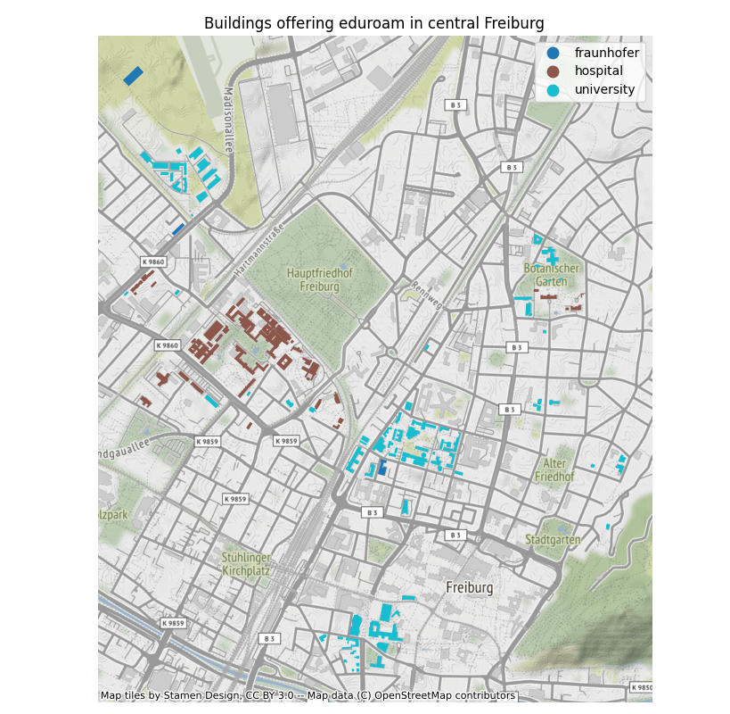

# fr_wifi
Checking whether the eduroam wifi coverage in the city of Freiburg is good enough to not have mobile internet.

Done in python using geopandas and geodata from www.geodaten.freiburg.de and www.geofabrik.de.

## Eduroam
Eduroam offers an internet connections to students and researchers. Eduroam Wifi routers are usually located in universities, but also in hospital and university affiliated organizations like Fraunhofer institutes

## Eduroam Wifi in Freiburg
In the following map, all buildings offering eduroam in freiburg are color coded. Even though there are a lot of eduroam buildings, it is probably not a good idea to ditch mobile internet.

